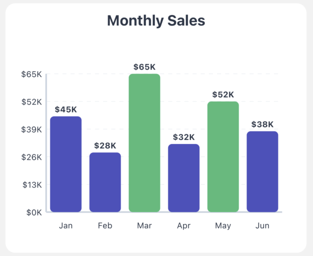
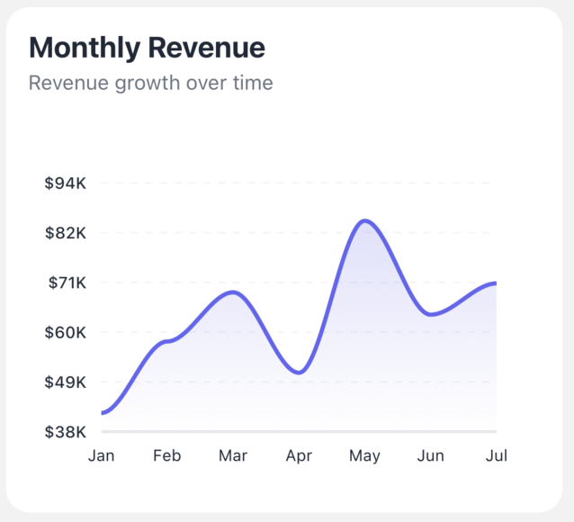

# 📊 Expo Charts

A modern, customizable charting library built specifically for Expo and React Native applications. Create beautiful, animated charts with minimal configuration.


## ✨ Current Features

- 📊 Beautiful Bar and Line charts with more coming soon!
- 📱 Built specifically for Expo and React Native
- 🎨 Fully customizable colors and styles
- ⚡ Smooth animations
- 📱 Responsive design
- 🔥 High performance
- 💪 TypeScript support
- 🔍 Interactive tooltips
- 📦 Lightweight

## 🗺️ Roadmap

We're actively working on expanding our chart offerings! Coming soon:

- 🥧 Pie Charts
- 📈 Area Charts
- 📊 Stacked Bar Charts
- 📉 Candlestick Charts
- 🎯 Radar Charts

## 🚀 Installation

```bash
# Using npm
npm install expo-charts react-native-svg

# Using yarn
yarn add expo-charts react-native-svg

# Using pnpm
pnpm add expo-charts react-native-svg
```

## 📋 Requirements

- Expo SDK 48 or later
- React Native 0.71.0 or later
- react-native-svg 13.0.0 or later

## 🎯 Quick Start

```jsx
import { BarChart, LineChart } from "expo-charts";

// Bar Chart Example
export default function App() {
  return (
    <BarChart
      data={data}
      width={350}
      height={250}
      title="Monthly Sales"
      primaryColor="#FF5733"
      secondaryColor="#C70039"
      formatValue={(value) => `$${value}K`}
      formatLabel={(index) => ["Jan", "Feb", "Mar", "Apr", "May", "Jun"][index]}
      onBarPress={(value, index) => {
        console.log(`Bar ${index} pressed with value ${value}`);
      }}
      getBarColor={(value) => (value > 50 ? "#48BB78" : "#4C51BF")}
      showXAxisLabels={true}
      showYAxisLabels={true}
    />
  );
}
```

## 📖 Available Charts

### 1. Bar Chart

The Bar Chart component offers extensive customization and interactivity:



```jsx
<BarChart
  data={[
    { label: "A", value: 10 },
    { label: "B", value: 20 },
  ]}
  width={300}
  height={200}
  title="Sales Data"
  colors={["#4C51BF", "#48BB78"]}
  animate={true}
  showValues={true}
  showGrid={true}
/>
```

#### Props

| Prop           | Type                                     | Default             | Description           |
| -------------- | ---------------------------------------- | ------------------- | --------------------- |
| data           | Array<{label: string, value: number}>    | []                  | Data to be displayed  |
| width          | number                                   | 300                 | Width of the chart    |
| height         | number                                   | 200                 | Height of the chart   |
| title          | string                                   | ''                  | Chart title           |
| primaryColor   | string                                   | '#4C51BF'           | Primary bar color     |
| secondaryColor | string                                   | '#48BB78'           | Secondary bar color   |
| animate        | boolean                                  | true                | Enable animations     |
| showValues     | boolean                                  | true                | Show values on bars   |
| showGrid       | boolean                                  | true                | Show background grid  |
| formatValue    | (value: number) => string                | (v) => v.toString() | Format value labels   |
| formatLabel    | (index: number) => string                | (i) => i.toString() | Format x-axis labels  |
| onBarPress     | (value: number, index: number) => void   | undefined           | Bar press handler     |
| getBarColor    | (value: number, index: number) => string | undefined           | Custom color function |

### 2. Line Chart

The Line Chart component supports both straight and curved lines with customizable styling:



```jsx
<LineChart
  data={linechartData}
  width={350}
  height={250}
  lineColor="#6366F1"
  accentColor="#818CF8"
  labelColor="#1F2937"
  axisColor="#E5E7EB"
  backgroundColor="#FFFFFF"
  title="Monthly Revenue"
  subtitle="Revenue growth over time"
  formatValue={(value) => `$${value}K`}
  formatLabel={(index) => months[index]}
  showGrid={true}
  animate={true}
  showDots={true}
  showArea={true}
/>
```

#### Props

| Prop            | Type                      | Default             | Description               |
| --------------- | ------------------------- | ------------------- | ------------------------- |
| data            | Array<number>             | []                  | Data points               |
| width           | number                    | 300                 | Width of the chart        |
| height          | number                    | 200                 | Height of the chart       |
| title           | string                    | ''                  | Chart title               |
| subtitle        | string                    | ''                  | Chart subtitle            |
| lineColor       | string                    | '#6366F1'           | Line color                |
| accentColor     | string                    | '#818CF8'           | Dots and highlights color |
| labelColor      | string                    | '#1F2937'           | Label text color          |
| axisColor       | string                    | '#E5E7EB'           | Axis lines color          |
| backgroundColor | string                    | '#FFFFFF'           | Chart background color    |
| showDots        | boolean                   | true                | Show data points          |
| showArea        | boolean                   | false               | Show area under line      |
| showGrid        | boolean                   | true                | Show background grid      |
| animate         | boolean                   | true                | Enable animations         |
| formatValue     | (value: number) => string | (v) => v.toString() | Format y-axis labels      |
| formatLabel     | (index: number) => string | (i) => i.toString() | Format x-axis labels      |

## 🎨 Styling Guide

Both charts support extensive customization through props:

```jsx
// Example of advanced styling
<BarChart
  style={{
    backgroundColor: "#FFFFFF",
    borderRadius: 8,
    padding: 16,
    shadowColor: "#000",
    shadowOffset: { width: 0, height: 2 },
    shadowOpacity: 0.1,
    shadowRadius: 4,
    elevation: 3,
  }}
  // ... other props
/>
```

## ⚡ Performance Tips

1. Use `React.memo` for static charts
2. Disable animations for real-time data
3. Memoize callbacks and formatters
4. Use appropriate dimensions for your device
5. Avoid unnecessary re-renders

## 🤝 Contributing

We welcome contributions! Please follow these steps:

1. Fork the repository
2. Create your feature branch (`git checkout -b feature/NewChart`)
3. Commit your changes (`git commit -m 'Add new chart type'`)
4. Push to the branch (`git push origin feature/NewChart`)
5. Open a Pull Request

## 📝 License

MIT License - see the [LICENSE](LICENSE) file for details.

## 📫 Support

Need help? We're here for you:

- Open an [issue](https://github.com/anshkaran7/expo-charts/issues)
- Email: support@ansh.tsx@gmail.com

---

Made with ❤️ by [Karandev.in](https://karandev.in)
